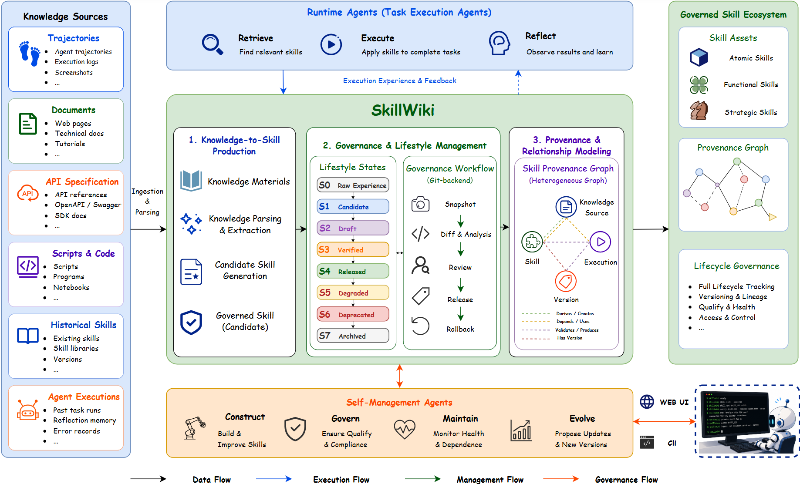

<div align="center">

# SkillWiki

**A Living Knowledge Infrastructure for Agent Skills**

Just as Wikipedia organizes human knowledge and GitHub governs software, **SkillWiki** provides the missing infrastructure for agent skills. It transforms heterogeneous knowledge sources — trajectories, documents, API specs, and execution experience — into reusable skill assets that are grounded in their originating evidence, version-controlled, and continuously evolved. SkillWiki covers the complete skill lifecycle: from knowledge ingestion and skill production, through provenance-aware graph exploration and human governance, to execution-driven health monitoring and automated evolution. The result is a shared infrastructure where knowledge, skills, and execution experience co-evolve together.

<br/>

[](LICENSE)
[](https://www.python.org/)
[](https://nodejs.org/)
[](https://github.com/Huangdingcheng/SkillWiki/stargazers)

<br/>

[📺 **Demo Video**](https://www.youtube.com/watch?v=TODO) &nbsp;·&nbsp;
[📖 **Paper**](https://arxiv.org/abs/2606.16523) 

</div>

---

<p align="center">
  
  <br/>
  <em>SkillWiki system overview — from multi-source ingestion to governed skill evolution.</em>
</p>

---

## Key Features

| | Feature | Description |
|:---:|---|---|
| 📥 | **Multi-source ingestion** | Trajectories, documents, API specs, scripts, and existing skill JSON/JSONL files |
| 🔄 | **Governed lifecycle** | Eight-stage state machine (S0–S7) with automated verification and full audit trail |
| 🕸️ | **Provenance knowledge graph** | Typed edges — `depends_on`, `composes_with`, `evolved_from`, `replaces`, and more |
| 🩺 | **Health & evolution engine** | Continuous monitoring detects degraded skills and queues repair proposals automatically |
| 🌐 | **Bilingual UI** | English (default) and Chinese — toggle via the language button in the header |
| ⌨️ | **CLI-first** | Every operation available as a `skillwiki` command for scripting and agent integration |

---

## Lifecycle

```
  S0 Raw  ──►  S1 Candidate  ──►  S2 Draft  ──►  S3 Verified  ──►  S4 Released
                                                                          │
                                             S7 Archived  ◄──  S6 Deprecated  ◄──  S5 Degraded
```

| State | Name | Meaning |
|:---:|---|---|
| **S0** | Raw | Ingested source material, not yet extracted |
| **S1** | Candidate | Extracted skill candidate awaiting review |
| **S2** | Draft | Formalized schema, pending verification |
| **S3** | Verified | Passed automated postcondition checks |
| **S4** | Released | Approved for agent use in production |
| **S5** | Degraded | Success rate fell below health threshold |
| **S6** | Deprecated | Replaced or retired |
| **S7** | Archived | Read-only historical record |

---

## Quick Start

### Requirements

- Python 3.10+
- Node.js 18+ *(frontend only)*

### Install

```bash
git clone https://github.com/Huangdingcheng/SkillWiki.git
cd SkillWiki/skillwiki

python -m venv venv
source venv/bin/activate      # Linux / Mac
venv\Scripts\activate         # Windows

pip install -r requirements.txt
pip install -e .
```

### Start the backend

```bash
skillwiki serve --port 8001 --api-key YOUR_LLM_API_KEY
```

### Start the frontend *(optional)*

```bash
cd ../skillwiki-frontend
npm install
npm run dev    # → http://localhost:3000
```

### One-click launcher (Windows)

Double-click **`START_SKILLWIKI_DEMO.bat`** in the repository root. On first run you will be prompted for your LLM endpoint and API key (saved to `skillwiki-launcher\config.local.ps1`, which is Git-ignored — never commit it).

```
Backend:  http://127.0.0.1:8001
Frontend: http://127.0.0.1:5174/wiki
```

Restore the public demo fixtures after a restart:

```
RESTORE_SKILLWIKI_DEMO_STATE.bat
```

---

## Demo Walkthrough

| Step | Page | What to explore |
|:---:|---|---|
| 1 | [`/wiki`](http://127.0.0.1:5174/wiki) | Skill library — browse, filter by state / tag, inspect schemas |
| 2 | [`/ingest`](http://127.0.0.1:5174/ingest) | Paste an API doc or upload a file; watch candidates extracted live |
| 3 | [`/graph`](http://127.0.0.1:5174/graph) | Provenance knowledge graph — Nebula, Readable, and Debug view presets |
| 4 | [`/harness`](http://127.0.0.1:5174/harness) | Execute-verify loop; observe automated repair attempts |
| 5 | [`/evaluation`](http://127.0.0.1:5174/evaluation) | SkillsBench P0 sparse-subset analysis |
| 6 | [`/versions`](http://127.0.0.1:5174/versions) | Business-readable diffs and re-verification after changes |

---

## CLI Reference

Install once after cloning:

```bash
cd skillwiki && pip install -e .
```

All commands accept `--api-url <URL>` (default `http://127.0.0.1:8001`).

### Server

```bash
skillwiki serve [--host HOST] [--port PORT] [--backend memory|sqlite|postgres]
```

### Knowledge Ingestion

```bash
# source_type: trajectory | document | api_doc | script | past_skills
skillwiki ingest run <source_type> <input> [--create]

skillwiki ingest run api_doc     ./openai_spec.md --create
skillwiki ingest run trajectory  "open browser -> search -> copy link"
skillwiki ingest run past_skills ./skills.json --max-candidates 20
skillwiki ingest status <candidate_id>
```

### Skill Lifecycle

```bash
skillwiki skill list    [--state S3] [--tag nlp] [--limit 20]
skillwiki skill get     <skill_id>   [--full]
skillwiki skill status  <skill_id>
skillwiki skill exec    <skill_id>   --input '{"key": "value"}'

skillwiki audit   <skill_id>
skillwiki verify  <skill_id>  [--harness mock|claude_code|codex] [--max-retries 3] [--watch]
skillwiki promote <skill_id>  <target_state>
```

### Health & Evolution

```bash
skillwiki health             [--json]   # system-wide overview
skillwiki health <skill_id>  [--json]   # success rate, issues, open proposals

skillwiki repair <skill_id>             # generate maintenance candidate
skillwiki evolve             [--json]   # run one full evolution cycle
```

### Maintenance Proposals

```bash
skillwiki proposal list    [--status pending|accepted|rejected] [--json]
skillwiki proposal accept  <proposal_id>
skillwiki proposal reject  <proposal_id>
```

### Knowledge Graph

```bash
skillwiki graph neighbors  <skill_id>  [--depth 1]
skillwiki graph show       <skill_id>  [--view skill_only|provenance|version_impact] [--depth 2]
skillwiki graph deps       <skill_id>
skillwiki graph export     <skill_id>  [-o output.json] [--view provenance] [--depth 2]
```

### Natural Language Execution

```bash
skillwiki run "summarize the attached PDF and extract action items" [--verbose]
```

---

## What This System Demonstrates

- **Five ingestion modalities** — trajectory, document, api_doc, script, past_skills.
- **Ctx2Skill-lite** evidence pipeline for document-to-skill extraction.
- **SkillX-style** granularity layers: `atomic`, `functional`, and `strategic`.
- **Heterogeneous provenance graph** with Nebula, Readable, and Debug view presets.
- **Version Lab** with business-readable diffs and re-verification after interface or implementation changes.
- **Local harness verification** via mock, Claude Code, and Codex executors.
- **SkillsBench P0** results: oracle `5/5` · no-skill baseline `2/5` · SkillWiki `3/5`.

---

## Environment Variables

| Variable | Default | Description |
|---|---|---|
| `LLM_API_KEY` | — | LLM API key *(required)* |
| `LLM_API_URL` | `https://api.deepseek.com` | LLM base URL |
| `LLM_MODEL` | `deepseek-v4-flash` | Model name |
| `SKILLOS_API_TARGET` | `http://127.0.0.1:8001` | Frontend proxy target |

---

## License

[MIT](LICENSE) © 2025 SkillWiki Authors
