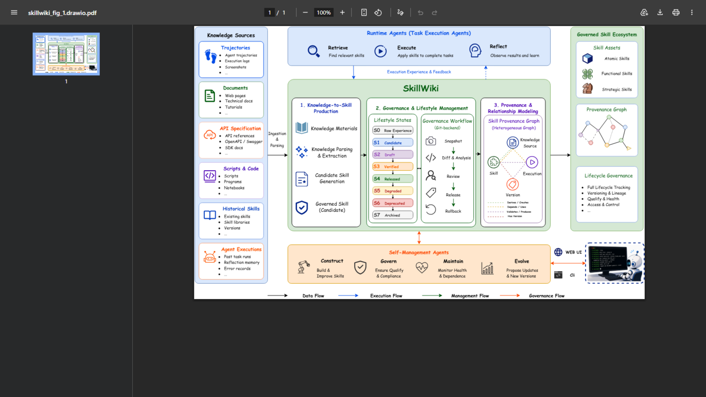

# SkillWiki

**A Living Knowledge Infrastructure for Agent Skills**

SkillWiki turns raw experience — trajectories, documents, API specs, scripts, and existing skill libraries — into versioned, auditable, graph-connected Skill objects that agents can discover, execute, and evolve. The full lifecycle is governed: **S0** (raw) → **S1** (candidate) → **S2** (draft) → **S3** (verified) → **S4** (released) → **S5** (degraded) → **S6** (deprecated) → **S7** (archived).

> **Demo video:** [YouTube — coming soon](https://www.youtube.com/watch?v=TODO)



---

## Key Features

- **Multi-source ingestion** — trajectories, Markdown documents, API specs, shell scripts, and existing skill JSON/JSONL files.
- **Governed lifecycle** — eight-stage state machine with automated verification, human-in-the-loop proposal review, and audit trails.
- **Knowledge graph** — skills are connected by typed edges (depends\_on, composes\_with, evolved\_from, replaces, …) with provenance and version-impact views.
- **Health & evolution engine** — continuous monitoring detects degraded or stale skills and queues maintenance proposals automatically.
- **Bilingual UI** — the web frontend ships in English (default) and Chinese; switch with the language button in the header.
- **CLI-first** — every operation is available as a `skillwiki` command for scripting and agent integration.

---

## Quick Start (Windows)

### 1. Install dependencies

```powershell
# Backend
cd <repo-root>\skillwiki
python -m pip install -r requirements.txt

# Frontend
cd <repo-root>\skillwiki-frontend
npm install
```

### 2. Start SkillWiki

Double-click `START_SKILLWIKI_DEMO.bat` in the repository root.

On the first run you will be prompted for:

| Prompt | Default |
|--------|---------|
| LLM API URL | `https://api.deepseek.com` |
| Model name | `deepseek-v4-flash` |
| API key | _(paste your key; input is hidden)_ |

Configuration is saved to `skillwiki-launcher\config.local.ps1` (Git-ignored; never commit this file).

Once started:

```
Backend:  http://127.0.0.1:8001
Frontend: http://127.0.0.1:5174/wiki
```

If either port is busy, the launcher picks a nearby free port and prints the actual URL.

### 3. Restore demo data

The default backend is in-memory, so data resets on restart. To reload the public demo fixtures:

```
RESTORE_SKILLWIKI_DEMO_STATE.bat
```

### 4. Stop SkillWiki

```
STOP_SKILLWIKI_DEMO.bat
```

---

## Recommended Demo Walkthrough

| Step | URL | What to show |
|------|-----|--------------|
| 1 | `/wiki` | Skill library, lifecycle states, search and filter |
| 2 | `/ingest` | Paste an API doc or upload a file; watch candidates appear |
| 3 | `/graph` | Knowledge graph with nebula / readable view presets |
| 4 | `/harness` | Execute-verify loop; observe auto-repair attempts |
| 5 | `/evaluation` | SkillsBench P0 analysis |
| 6 | `/versions` | Business-readable diffs and re-verification after changes |

---

## CLI Reference

Install the CLI once after cloning:

```powershell
cd <repo-root>\skillwiki
venv\Scripts\activate
pip install -e .
```

All commands accept `--api-url <URL>` to point at a non-default backend (default `http://127.0.0.1:8001`).

### Start the backend

```bash
skillwiki serve
skillwiki serve --host 127.0.0.1 --port 8001 --backend memory
```

### Ingest experience

| SOURCE\_TYPE | Typical formats | Description |
|---|---|---|
| `trajectory` | `.txt`, `.md` | Operation sequences / conversation traces |
| `document` | `.md`, `.txt` | Knowledge docs, tutorials, specifications |
| `api_doc` | `.md`, `.txt`, `.yaml` | API endpoint documentation |
| `script` | `.sh`, `.md` | Shell / automation scripts |
| `past_skills` | `.json`, `.jsonl` | Existing skill definitions |

```bash
skillwiki ingest run document ./tutorial.md --create
skillwiki ingest run trajectory "open browser -> search -> copy link"
skillwiki ingest run past_skills ./skills.json --max-candidates 20
skillwiki ingest status <candidate_id>
```

### Lifecycle management

```bash
# List, inspect, and execute skills
skillwiki skill list [--state S3] [--tag nlp] [--limit 20]
skillwiki skill get <skill_id> [--full]
skillwiki skill status <skill_id>
skillwiki skill exec <skill_id> --input '{"key": "value"}'

# Static audit (schema, safety, postcondition alignment)
skillwiki audit <skill_id>

# Execute-verify loop with optional auto-promote
skillwiki verify <skill_id> [--harness mock|claude_code|codex] [--max-retries 3] [--watch]

# Manually advance lifecycle state
skillwiki promote <skill_id> <target_state>   # e.g. S2, S3, released
```

### Health monitoring

```bash
skillwiki health                      # system-wide overview
skillwiki health <skill_id>           # per-skill: success rate, issues, open proposals
skillwiki health [<skill_id>] --json
```

### Maintenance proposals

```bash
skillwiki proposal list [--status pending|accepted|rejected] [--json]
skillwiki proposal accept <proposal_id>
skillwiki proposal reject <proposal_id>
```

### Repair and evolution

```bash
skillwiki repair <skill_id>   # generate a maintenance candidate for a degraded skill
skillwiki evolve [--json]     # run one full evolution cycle
```

### Knowledge graph

```bash
skillwiki graph neighbors <skill_id> [--depth 1]
skillwiki graph show <skill_id> [--view skill_only|provenance|version_impact] [--depth 2]
skillwiki graph deps <skill_id>
skillwiki graph export <skill_id> [-o output.json] [--view provenance] [--depth 2]
```

### Natural language task execution

```bash
skillwiki run "analyze this PDF and extract action items" [--verbose]
```

---

## Lifecycle States

| Code | Name | Meaning |
|------|------|---------|
| S0 | Raw | Ingested source material, not yet extracted |
| S1 | Candidate | Extracted skill candidate awaiting review |
| S2 | Draft | Formalized schema, pending verification |
| S3 | Verified | Passed automated postcondition checks |
| S4 | Released | Approved for agent use in production |
| S5 | Degraded | Success rate fell below health threshold |
| S6 | Deprecated | Replaced or retired |
| S7 | Archived | Read-only historical record |

---

## What This System Demonstrates

- Multi-source ingestion covering all five input types.
- Ctx2Skill-lite evidence pipeline for document-to-skill extraction.
- SkillX-style granularity metadata: `atomic`, `functional`, and `strategic` layers.
- Knowledge graph visualization with Nebula, Readable, and Debug view presets.
- Version Lab with business-readable diffs and re-verification after interface or implementation changes.
- Local harness verification (mock, Claude Code, and Codex executors).
- SkillsBench P0 sparse-subset analysis: oracle `5/5`, no-skill `2/5`, SkillWiki `3/5` using combined evidence.

---

## Environment Variables

| Variable | Default | Description |
|----------|---------|-------------|
| `LLM_API_KEY` | — | LLM API key (required) |
| `LLM_API_URL` | `https://api.deepseek.com` | LLM base URL |
| `LLM_MODEL` | `deepseek-v4-flash` | Model name |
| `SKILLOS_API_TARGET` | `http://127.0.0.1:8001` | Frontend proxy target |

---

## Safety Notes

Do not commit:

- `skillwiki-launcher\config.local.ps1`
- `skillwiki-launcher\runtime\`
- Raw benchmark run directories
- Docker images or cache
- `.venv`, `node_modules`, or build output
- API keys or local credentials
