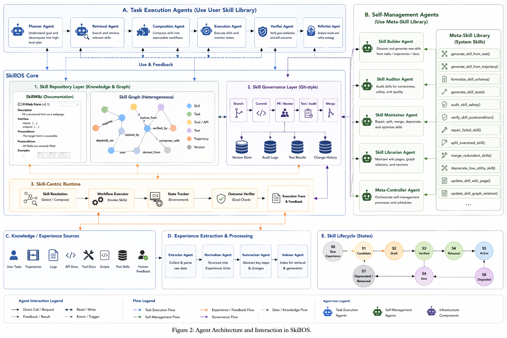

# SkillOS: A Skill-Centric Operating System for Self-Evolving Agents

> EMNLP 2025 Demo Submission

SkillOS 是一个以 Skill 为核心的 Agent 操作系统，通过结构化的 Skill 知识库、Git 式版本治理和自演化闭环，让 Agent 能够持续学习、复用和改进技能。



---

## 核心贡献

| 特性 | 描述 |
|------|------|
| **3 层 Skill 类型体系** | Atomic (L1) / Functional (L2) / Strategic (L3)，覆盖从原子操作到元认知策略 |
| **8 状态生命周期** | S0 Raw → S1 Candidate → S2 Draft → S3 Verified → S4 Released → S5 Degraded → S6 Deprecated → S7 Archived |
| **Git 式版本治理** | Branch / Commit / PR / Review / Test / Merge，完整变更历史与 diff 视图 |
| **自演化闭环** | 任务执行 → 经验提取 → Skill 生成/更新 → 质量评估 → 版本演化 |
| **双 Agent 体系** | Task Execution Agents（6个）+ Self-Management Agents（5个）协同工作 |

---

## 快速启动

### 环境要求
- Python 3.10+
- Node.js 18+
- Anthropic API Key（或兼容 OpenAI 格式的 API）

### 后端启动

```bash
cd skillos
pip install -r requirements.txt
python -m skillos.api.main --api-key YOUR_API_KEY --port 8000
```

### 前端启动

```bash
cd skillos-frontend
npm install
npm run dev
# 访问 http://localhost:5173
```

### Docker 启动（可选）

```bash
docker-compose up
```

---

## 项目结构

```
skill wiki/
├── skillos/                    # 后端（FastAPI + Python）
│   ├── skillos/
│   │   ├── api/                # REST API 路由、Schema、依赖注入
│   │   ├── layers/             # 核心业务层
│   │   │   ├── skill_repository/   # Skill 存储与图谱
│   │   │   ├── skill_governance/   # 版本控制与治理
│   │   │   ├── skill_runtime/      # 执行引擎与 Agent 链
│   │   │   ├── skill_management/   # 自管理 Agent
│   │   │   ├── skill_construction/ # Skill 构建与验证
│   │   │   ├── input_knowledge/    # 知识导入 Pipeline
│   │   │   └── feedback_evolution/ # 反馈与演化
│   │   ├── models/             # Pydantic 数据模型
│   │   ├── storage/            # 存储适配器（内存/PostgreSQL/Neo4j）
│   │   └── utils/              # LLM 客户端、日志等工具
│   └── tests/                  # 测试套件
├── skillos-frontend/           # 前端（React + Vite + Ant Design）
│   └── src/
│       ├── pages/              # 9 个功能页面
│       ├── api/                # API 客户端与类型定义
│       ├── components/         # 公共组件
│       ├── store/              # Zustand 状态管理
│       └── hooks/              # WebSocket 等 Hooks
└── docs/                       # 项目文档（本目录）
    ├── README.md               # 本文件
    ├── architecture.md         # 整体架构与工作流（只读）
    ├── modules/                # 各模块细化文档
    └── TASK_ASSIGNMENT.md      # 团队任务分派
```

---

## 技术栈

**后端**
- FastAPI + Uvicorn（异步 REST API）
- Pydantic v2（数据验证与序列化）
- Anthropic Claude API（LLM 调用）
- WebSocket（实时事件推送）

**前端**
- React 18 + TypeScript + Vite
- Ant Design 5（UI 组件库）
- AntV G6（知识图谱可视化）
- Framer Motion（动画）
- Zustand（状态管理）

---

## 前端页面

| 路由 | 页面 | 功能 |
|------|------|------|
| `/` | Dashboard | 系统概览、演化指标、实时事件 |
| `/demo` | **Self-Evolution Demo** | 完整自演化闭环演示（EMNLP 核心展示） |
| `/wiki` | Skill Wiki | Skill 目录、搜索、详情 |
| `/graph` | Knowledge Graph | 交互式知识图谱（AntV G6） |
| `/execution` | Agent Execution | 任务执行、Skill 检索展示 |
| `/evolution` | Evolution | 系统健康监控、自动修复 |
| `/lifecycle` | Lifecycle Demo | 状态机可视化 |
| `/ingest` | Knowledge Import | 轨迹/文档/API/代码导入 |
| `/versions` | Version Control | Git 式版本历史与 diff |

---

## API 文档

启动后端后访问：
- Swagger UI: http://localhost:8000/docs
- ReDoc: http://localhost:8000/redoc

---

## 文档导航

- [整体架构与工作流](./architecture.md) — 系统设计全貌（只读）
- [Skill Repository Layer](./modules/01-skill-repository.md)
- [Skill Governance Layer](./modules/02-skill-governance.md)
- [Skill Runtime & Task Execution Agents](./modules/03-skill-runtime.md)
- [Self-Management Agents](./modules/04-self-management-agents.md)
- [Frontend, API & Experience Pipeline](./modules/05-frontend-api-pipeline.md)
- [团队任务分派](./TASK_ASSIGNMENT.md)

---

## 引用

```bibtex
@inproceedings{skillos2025,
  title={SkillOS: A Skill-Centric Operating System for Self-Evolving Agents},
  booktitle={Proceedings of EMNLP 2025 (Demo Track)},
  year={2025}
}
```
